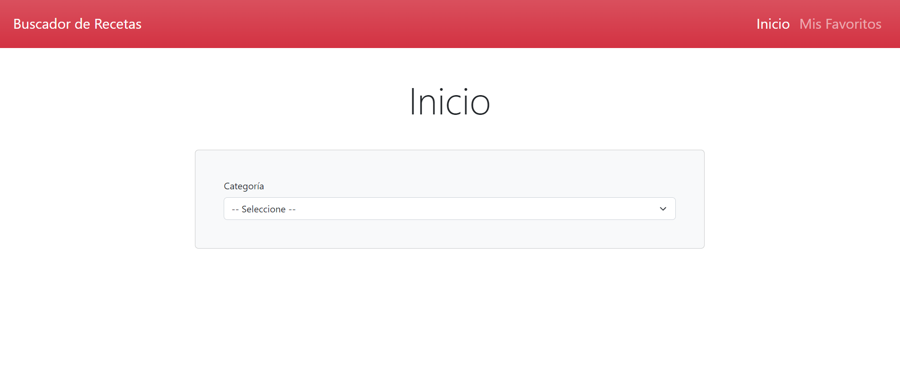
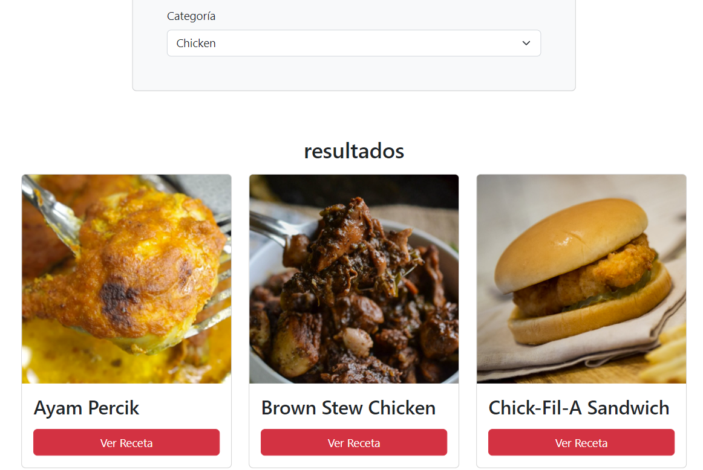
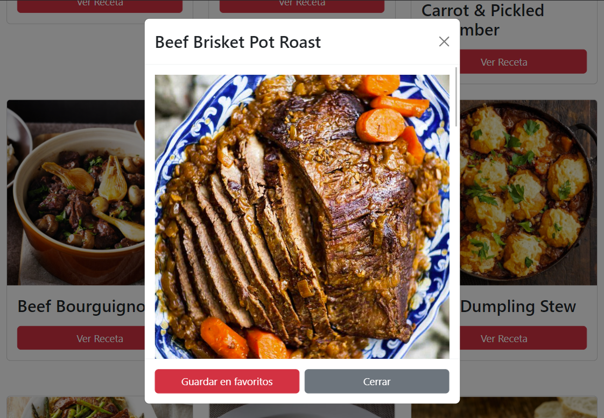
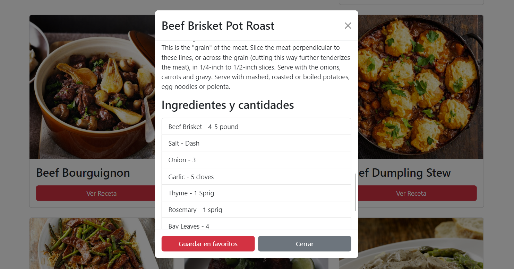
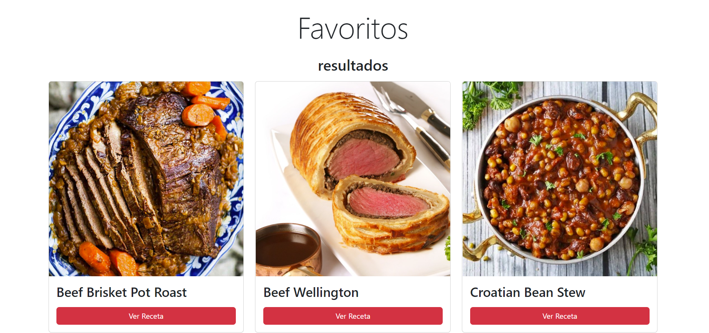

# **`Buscador de Recetas`** 
# *`Practicando fetch y manipulación del DOM`* 
### **`Nahuel-DevOne`**

# *Información del proyecto:*

El proyecto es un buscador de recetas, que hace el llamado  a 3 apis, para renderizar en el html recetas de comidas.  

## *Version 1.0.0:*

- 

- No tiene incorporada ninguna base de datos, pero usa localStorage como persistencia de los datos, para mantener guardadas las recetas en favoritos.

## *Desarrollado con:*

- [Visual Studio Code](https://code.visualstudio.com/)
- [HTML](https://developer.mozilla.org/es/docs/Web/HTML)
- [Bootstrap](https://getbootstrap.com/)
- [JavaScript](https://developer.mozilla.org/es/docs/Web/JavaScript)

## **Screenshots:**

### 1. Home:
## 

### 2. Llamado a la API:
## 

### 3. Receta:
## 

### 4. Información de la receta:
## 

### 5. Favoritos:
## 

  <!-- Hecho con amor -->
